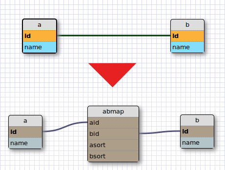
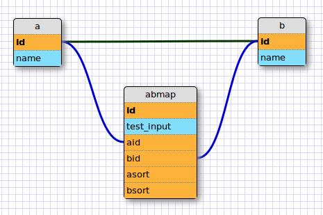

# m:m - Relation

## Struktur

Eine m:m-Relation (auch "m:n"-, "many-to-many"- oder "Geschwister"-Relation genannt) zwischen zwei Tabellen zeichnet sich dadurch aus, dass Einträge in der *einen* jeweils mit *mehreren* Einträgen der anderen Tabelle verknüpft werden können. 

Dafür wird klassischerweise eine Hilfstabelle verwendet, die die Relationen speichert. cms-kit erzeugt über die Modellierung für eine m:m-Relation automatisch eine Hilfstabelle. Für die Tabellen "a" und "b" heisst diese Hilfstabellen z.B. "abmap". Diese Tabelle -unten im Bild hineinmontiert- ist auf der Modellierungsebene nicht zu sehen sondern lediglich über die grüne Verbindungslinie vertreten.

(*oben: Ansicht in der Modellierung, unten: Tabellen, die in der Datenbank angelegt werden*)

Der Name der versteckten Tabelle setzt sich aus

* den beiden zu verknüpfenden Tabellennamen, *alphabetisch sortiert* und
* dem Zusatz "map" (für "Mapping-Tabelle")

zusammen und hat vier Felder.

1. Name der Tabelle 1 + "id" (im Beispiel: "aid")
2. Name der Tabelle 2 + "id" (im Beispiel: "bid")
3. Name der Tabelle 1 + "sort" (im Beispiel: "asort")
4. Name der Tabelle 2 + "sort" (im Beispiel: "bsort")

Zusätzlich zur Relation (speichern der beiden zu verknüpfenden IDs) wird über die Sort-Felder die *Reihenfolge der Verknüpfungen* hinterlegt.

## m:m - Relation "aufbohren"

Manchmal ist es interessant, zusätzlich zu den "einfachen" m:m-Relationen weitere Informationen abzuspeichern.

Über zusätzliche Felder in der Verknüpfungstabelle können dann beliebige Metadaten an die Verknüpfung gebunden, **der Vorgang** also um zusätzliche Informationen angereichert werden.

Dafür ist es notwendig, das klassische System der m:m-Tabellen-Nutzung "auszutricksen", indem man dem System eine eigene, von Hand erstellte "Map-Tabelle" unterjubelt.

(*Modellierungsbeispiel: die blauen Felder sind optionale Eingabefelder für eigene Daten, die orangenen Integer-Felder sind notwendig*)

Diese selbst erstellte Tabelle wird anstelle der klassischen m:m-Tabelle verwendet, d.h. Einträge in dieser Tabelle werden  bei der Verknüpfung von Einträgen in den beiden Ursprungstabellen automatisch erstellt.

Im Backend erscheint nun die Verknüpfungstabelle *zusätzlich* als Bereich und bei einer Verknüpfung (im Beispiel von "a" und "b") zusätzlich ein Eintrag ("abmap" oder wie auch immer der Bereich dann über die Übersetzung gelabelt wird). Die Verknüpfung lässt sich aufrufen und zusätzlich eingerichtete Felder (im Beispiel das Feld "test_input") mit weiteren Daten füttern. Wird die Haupt-Verknüpfung aufgelöst wird der entsprechende Verknüpfungs-Eintrag automatisch gelöscht.

Die Methode $*a*->Get*b*Map() gibt nun zusätzlich zu den verknüpften b-Einträgen die Informationen aus der Verknüpfungstabelle mit.

### und so gehts

* die beiden Tabellen werden wie gewohnt über eine m:m-Verknüpfung verbunden
* in der Modellierung wird *zusätzlich* zu den beiden zu verknüpfenden Tabellen eine Tabelle erzeugt, *die genau so heisst wie die automatisch erstellte Mapping-Tabelle*
* diese manuell erstellte Mapping-Tabelle wird über 1:m-Verknüpfungen mit beiden Tabellen verbunden (dies erzeugt die zwei Felder "Tabelle1 + id" und "Tabelle2 + id")
* zusätzlich werden zwei Sortier-Felder (Typ Integer) erstellt
* in dieser Tabelle lassen sich nun weitere Felder für eigene Inhalte hinterlegen

### wichtige Hinweise

* in der Objekt-Liste ("Export">"Objekte sortieren") muss das "Map"-Objekt *vor* den beiden "Elternobjekten" stehen.
* für "normale" Backend-User sollte die Möglichkeit, Einträge in dem Bereich zu *erstellen*, zu *löschen* und zu *verknüpfen* abgeschaltet werden (Einträge und Verknüpfungen werden schliesslich automatisch erzeugt).
* Das Verfahren funktioniert "von Haus aus" nur mit Auto-Increment IDs.
* Felder in dem Unter-Objekt dürfen nicht genauso heissen wie Felder in einem der Eltern-Objekte, da es sonst Namenskollisionen bei der Ausgabe gibt.
* Wird die Klasse über spätere Veränderungen an den Haupt-Objekten überschrieben, muss die (zusätzliche Verknüpfungs-)Klasse ebenfalls erneuert werden. Dies geschieht in der Prozessierung über den kompletten Neuaufbau aller PHP-Klassen.

